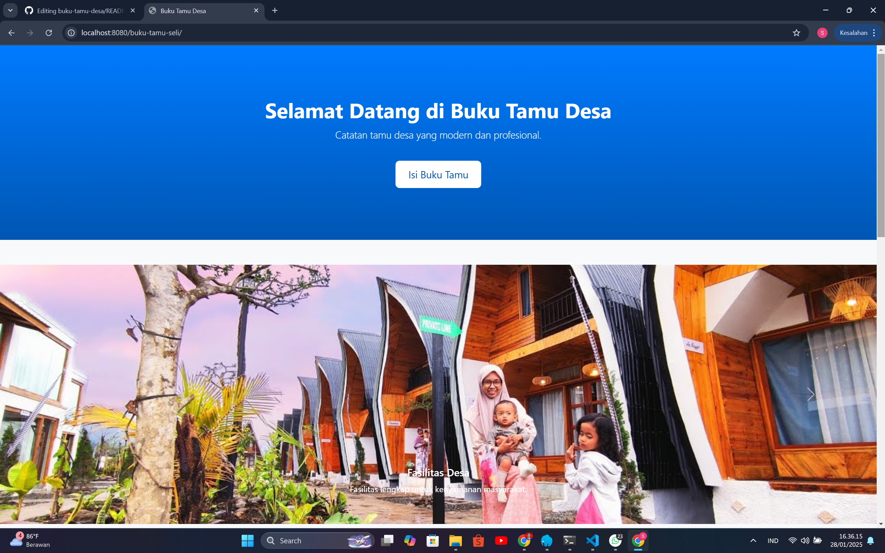
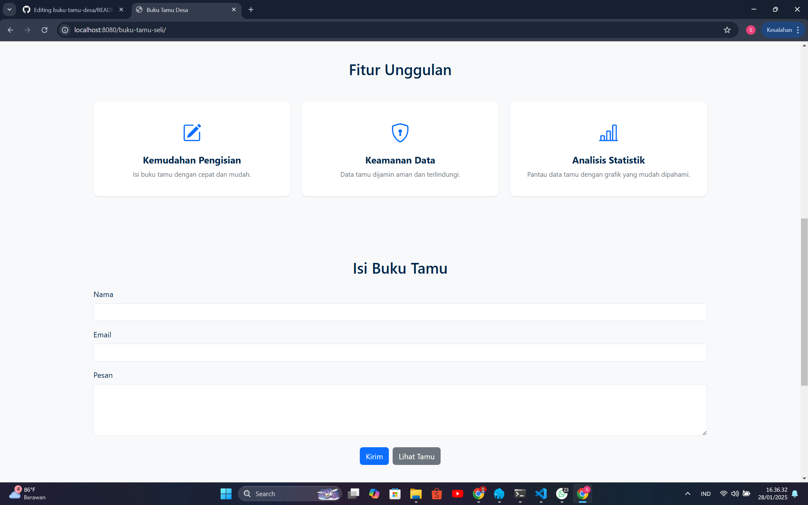
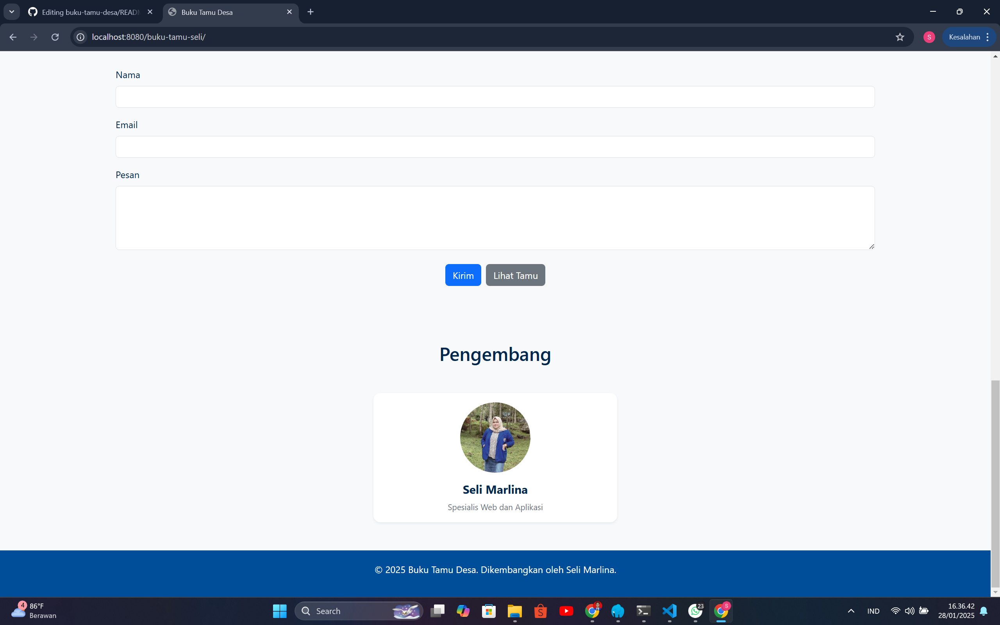
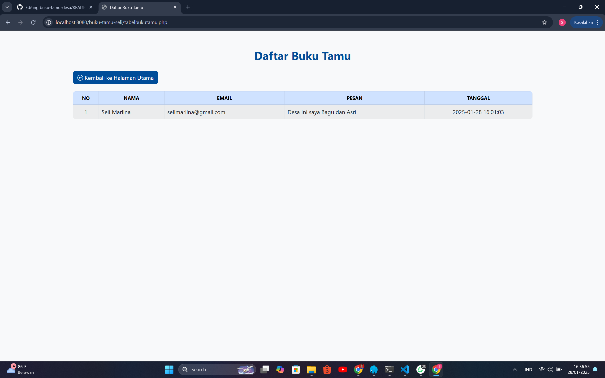

# Sistem Buku Tamu Desa

Sistem Buku Tamu Desa adalah aplikasi berbasis web yang dirancang untuk mencatat dan mengelola data tamu yang berkunjung ke desa. Aplikasi ini membantu meningkatkan efisiensi pencatatan dengan fitur modern yang mudah digunakan.

## Fitur Utama

- **Formulir Input Tamu**: Tamu dapat mengisi data kunjungan seperti nama, alamat, tanggal kunjungan, tujuan, dan nomor kontak.
- **Dashboard Admin**: Admin dapat melihat, mencari, mengedit, dan menghapus data tamu.
- **Statistik Kunjungan**: Menampilkan jumlah tamu secara visual (grafik).
- **Cetak Laporan**: Mendukung pembuatan laporan PDF dan Excel.
- **Desain Responsif**: Tampilan yang dapat diakses dari desktop maupun perangkat mobile.

## Teknologi yang Digunakan

- **Backend**: PHP 7.4+
- **Database**: MySQL/MariaDB
- **Frontend**: HTML5, CSS3, Bootstrap, JavaScript

## Tampilan Sistem




## Instalasi

1. Clone repository ini:
   ```bash
   git clone https://github.com/selimarlina/sistem-buku-tamu-desa.git
